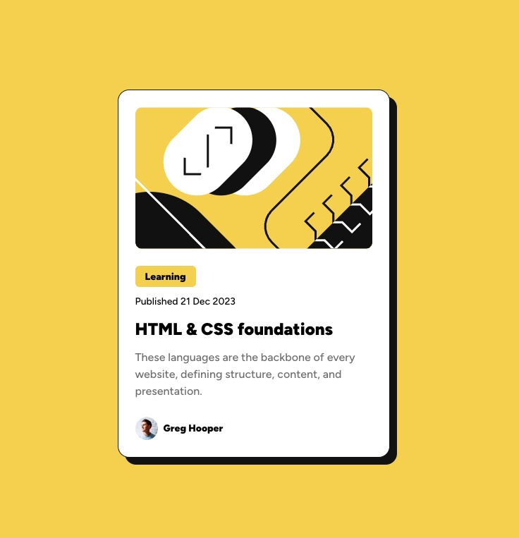

# Frontend Mentor - Blog preview card solution

This is a solution to the [Blog preview card challenge on Frontend Mentor](https://www.frontendmentor.io/challenges/blog-preview-card-ckPaj01IcS). Frontend Mentor challenges help you improve your coding skills by building realistic projects. 

## Table of contents

- [Overview](#overview)
  - [The challenge](#the-challenge)
  - [Screenshot](#screenshot)
  - [Links](#links)
- [My process](#my-process)
  - [Built with](#built-with)
  - [What I learned](#what-i-learned)
- [Author](#author)

## Overview

### The challenge

Users should be able to:

- See hover and focus states for all interactive elements on the page

### Screenshot

### Links

- Solution URL: [Add solution URL here](https://github.com/PawelM98/blog-preview-card-fmentor)
- Live Site URL: [Add live site URL here](https://blog-preview-card-mentorf.netlify.app/)

## My process

### Built with

- Semantic HTML5 markup
- CSS custom properties
- Flexbox
- CSS Grid

### What I learned

I learned more on how to use design files. Also I read about pixel perfect design and implementation of them [here](https://www.joshwcomeau.com/css/pixel-perfection/). I encourage everybody reading to read joshwcomeau article i linked in this section. It helped me a lot understanding that we should aim for pixel pretty close and with that approach I feel less frustrated about implementing designs.

Also i learned from this article how to properly measure spacing and other things. If you are using figma You need to zoom to 100% and then measure what you want and compare with actual implementation.

## Author

- Frontend Mentor - [@PawelM98](https://www.frontendmentor.io/profile/PawelM98)
- Twitter/X - [@pxlpaul_dev](https://x.com/pxlpaul_dev)
